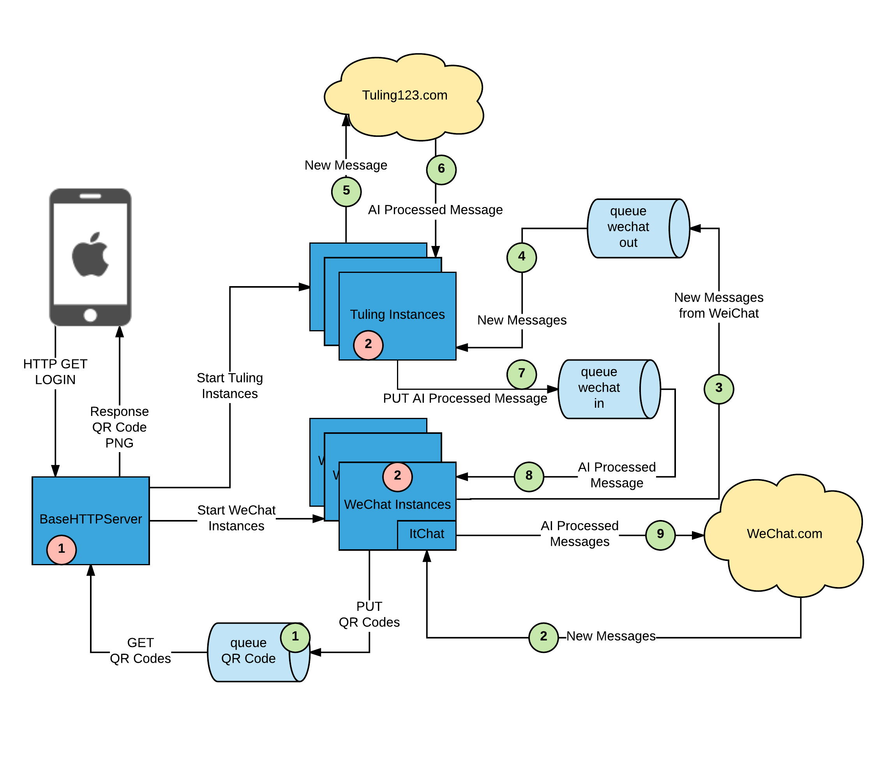
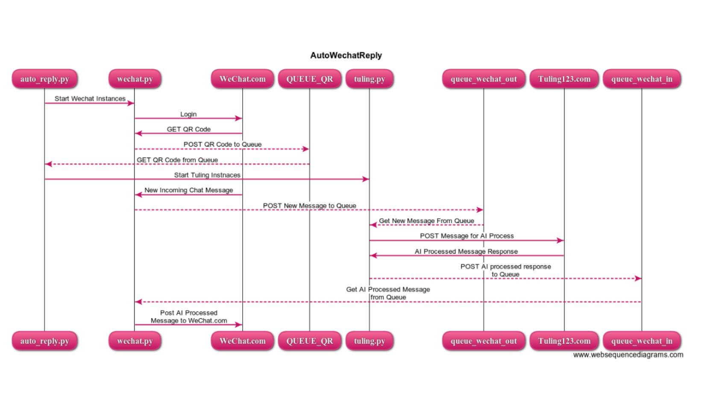

# autoWechatReply

Using [itchat](https://github.com/littlecodersh/ItChat) to communicate with WeChat.
Send wechat user messages to AI backend, then post AI responses back to WeChat.

## Rough Design Diagram

## requirements

requires python 2.7 

~~~
pip install -r requirements.txt
~~~

## Running
~~~
python src/auto_reply.py
~~~

## Testing

from project's directory

~~~
py.test -v
~~~

## Todo

* add unittest for the code
	* any ready to use mock for wechat
	* responses mock for http
